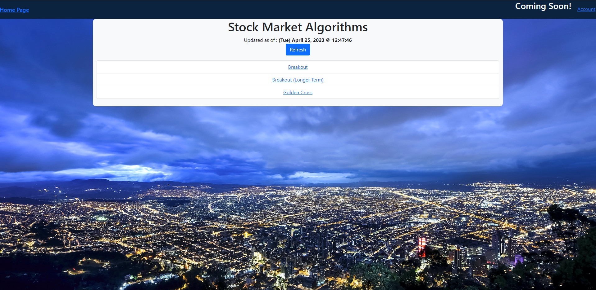
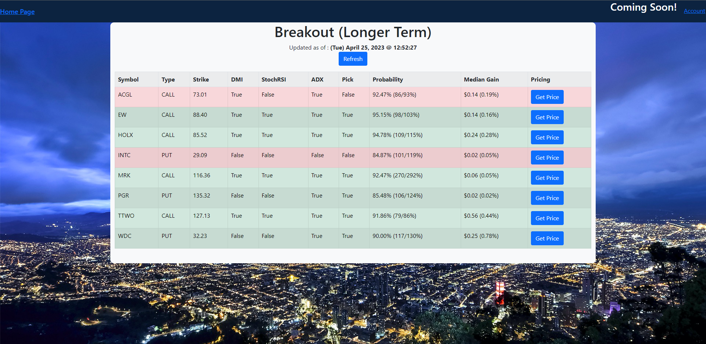
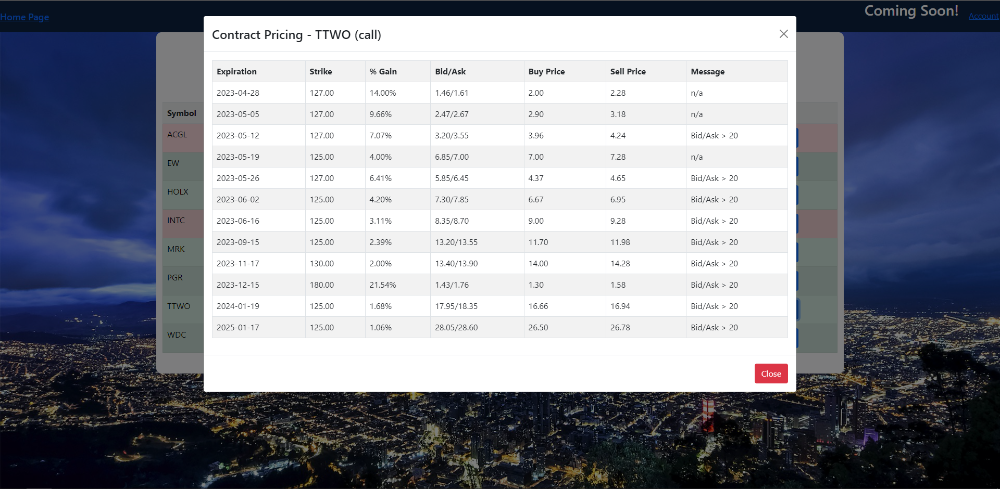

# Stock Market Analysis

A few technical analysis indicators, backtested each run, with a high probability of success.

Each algorithm searches the list of S&P 500 companies traded on the stock market for a given trend.

Each trend provides the probability of success, as well as Option entry and exit prices based off a backtested average.

Two additional indicators (Stochastic RSI and ADX/DMI) are calculated to validate whether the trend has a higher change of success.

If the Stochastic RSI is trending in the same direction as the script algorithm, then a trend is increasing in strength.

If the ADX/DMI is trending in the same direction as the script algorithm, then more investors are buying/selling according to the trend.





## Algorithms

### Breakout

A modified version of Keltner channels is used to identify an increase in volatility.

If a symbol closes for the day above a 20-day average range, it has a high probability of continuing a trend into the next day.

After the next day, the chances of a reversal of trend is likely, but unknown.

### Breakout (Modified)

Similar to the above Breakout trend, a modified Keltner channel is used.

If a symbol closes from a Breakout trend the next day, the chance of a reversal is likely to be very low.

This modified Breakout trend will indicate that a stock has a high probability of continuing to climb for the next few days.

### ADX Cross

When a trend is confirmed in a direction, investors will more than likely make trades according to the trend.

This algorithm catches the trend a day or two before, in an attempt to ride the trend of a stock for a longer period of time.

Entry and exit prices are only calculated for overnight holds, although the trend may continue for longer.

### Golden/Death Cross

Golden Cross - 50 day average crosses above 200 day average

Death Cross - 50 day average crosses below 200 day average

When a Golden Cross or Death Cross forms, investors tend to buy or sell with strong sentiment toward the direction of the cross.

This algorithm catches the trend a day or two before, in an attempt to ride the trend of a stock for a longer period of time.

Entry and exit prices are only calculated for overnight holds, although the trend may continue for longer.

## Getting Started

### Install Podman or Docker

https://podman.io/getting-started/installation.html

or

https://docs.docker.com/get-docker/

### When using as a Docker (or Podman) application :

In the project directory, type :

```
podman build -t breakout_options Dockerfile
podman run -d -v %CD%:/usr/src/app -p 0.0.0.0:5000:5000 --name=app breakout_options
```

or

```
docker build -t breakout_options Dockerfile
docker run -d -v %CD%:/usr/src/app -p 0.0.0.0:5000:5000 --name=app breakout_options
```
Then point your browser to http://localhost:5000!

## Key Notes!

On the first time running the script, a full stock market history is downloaded, compressed, and stored locally (<400 MB).

This first run may take about and hour to run, but is crucial for producing accurate backtesting data.

Any other time than the first run, only incremental data is downloaded when the Refresh button is clicked.

# Disclaimer

- All investments involve risk, and the past performance of a security, industry, sector, market, financial product, trading strategy, or individual’s trading does not guarantee future results or returns. Investors are fully responsible for any investment decisions they make. Such decisions should be based solely on an evaluation of their financial circumstances, investment objectives, risk tolerance, and liquidity needs.

- Any opinions, news, research, analyses, prices, or other information offered is provided as general market commentary, and does not constitute investment advice. I will not accept liability for any loss or damage, including without limitation any loss of profit, which may arise directly or indirectly from use of or reliance on such information.