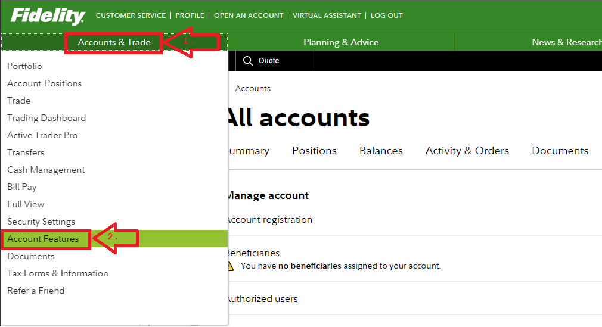
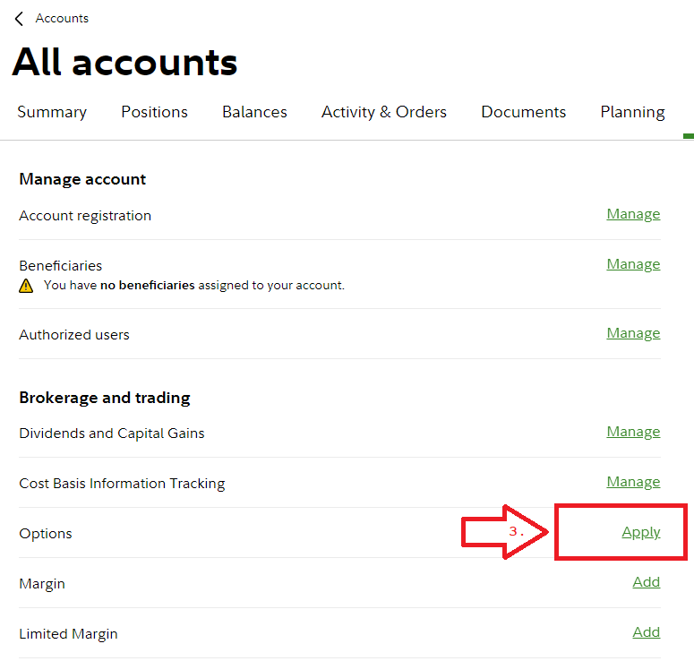
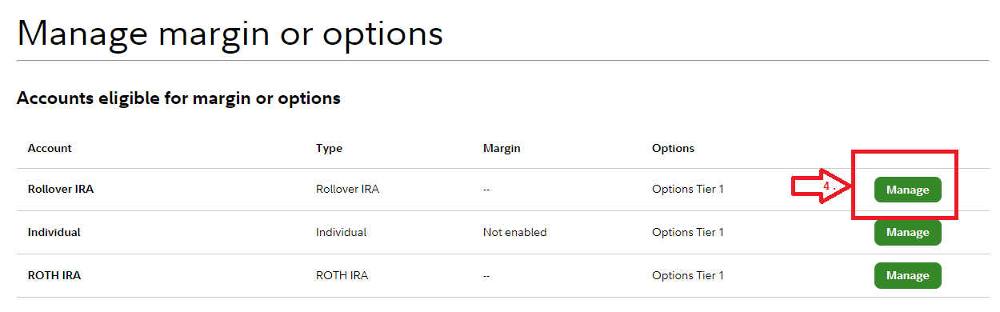

Log in to Fidelity and select the "Accounts & Trade" menu.

Select the "Account Features" from the dropdown that appears.

-----
In the main window, under "Brokerage and trading", select the "Apply" link to the right of "Options".

-----
Select "Manage" for the account desired for trading Options. Follow the prompts to enable Options trading.

-----

Good Luck!